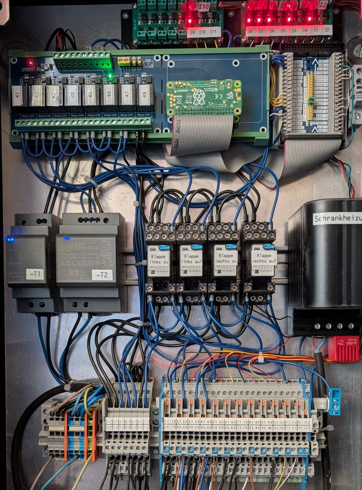

# Paketbox Steuerung 📦


Dieses Projekt steuert eine intelligente Paketbox mit einem Raspberry Pi. Die Box kann Pakete sicher aufnehmen, automatisch verriegeln und entleeren. Die Steuerung erfolgt über Motoren, Sensoren und Relais mit professioneller Fehlerbehandlung und Logging.

## ✨ Features
- **Automatisches Öffnen und Schließen** der Entleerungsklappen
- **Intelligente Türverriegelung** nach Paketeingang
- **Umfassende Sensorüberwachung** für alle Klappen und Türen
- **Robuste Fehlerbehandlung** mit automatischen ERROR-States
- **Professionelles Logging** mit Datei- und Console-Output
- **Mock-Modus** für lokale Entwicklung ohne Hardware
- **MQTT-Integration** für IoT-Benachrichtigungen
- **Thread-sichere Zustandsverwaltung** mit Locking-Mechanismen
- **Automatische Versionierung** basierend auf Commit-Types
- **Modulare Architektur** mit separaten Komponenten
- **15-Minuten-Watchdog** für geöffnete Paketzustellertüren inkl. MQTT-Warnung und Auto-Entleerung

## 🆕 Neueste Änderungen (Herbst 2025)
- **Watchdog für geöffnete Türen**: In `handler.py` überwacht ein 15-Minuten-Timer offene Paketzustellertüren, verschickt bei Bedarf MQTT-Warnungen und startet automatisch den Entleerungszyklus.
- **Zentraler TimerManager**: `TimerManager.py` verwaltet jetzt alle Motor-, Prüf- und Watchdog-Timer mit Thread-Lock, wodurch Nothalt-Szenarien sämtliche Timer zuverlässig abbrechen.
- **Verbesserter Fehler-Reset**: `ResetErrorState()` initialisiert Türsensoren neu, setzt Motorzustände sicher auf `STOPPED` und verhindert doppelte MQTT-Fehlerbenachrichtigungen.

## 🔧 Hardware
- **Raspberry Pi** mit GPIO-Steuerung
- **2 Motoren** für Entleerungsklappen mit Endlagensensoren
- **Relais-Board** für Motorsteuerung und Türverriegelung
- **Sensoren**:
  - Endlagensensoren für beide Klappen (offen/geschlossen)
  - Türsensoren für Paketzustellertür
  - Briefkastensensoren für Entnahme
  - Bewegungsmelder für Einklemmschutz
- **Taster** für Gartentüröffner (Nr. 6 und 8)
- **Beleuchtung** für Mülltonne und Paketbox


*Elektronische Komponenten: Raspberry Pi, Relais-Board, Sensorleitungen und Spannungsversorgung.*

## 🚀 Quick Start

### Installation
1. **Python 3** installieren (3.7+)
2. **Repository klonen**:
   ```bash
   git clone https://github.com/AndreasBeyer/paketbox.git
   cd paketbox
   ```
3. **Automatische Versionierung einrichten**:
   ```bash
   python setup_versioning.py
   ```
4. **Abhängigkeiten** (optional):
   ```bash
   pip install paho-mqtt  # Für MQTT-Funktionalität
   pip install RPi.GPIO   # Nur auf Raspberry Pi
   ```

### Erste Schritte
```bash
# Lokaler Test (Mock-Modus)
python paketbox.py

# Tests ausführen (empfohlen)
python tests/run_tests.py

# Version manuell erhöhen
python update_version.py patch
```

### Produktive Verwendung
```bash
# Auf Raspberry Pi mit Hardware
python paketbox.py
```

## 🛠️ Entwicklung & Test

### Lokale Entwicklung
```bash
# Mock-Modus für Entwicklung ohne Hardware
python paketbox.py
# Ausgabe: "[MOCK] GPIO setmode(BCM)" zeigt Simulation an

# Tests ausführen (umfassend)
python tests/run_tests.py

# Spezifische Tests
python -m unittest tests.test_paketbox.TestPaketBox.test_Klappen_oeffnen_success -v
```

### Test-Umgebung
Das Projekt enthält eine umfassende Test-Suite:
- **GPIO-Simulation**: Vollständige Hardware-Simulation ohne Raspberry Pi
- **Unit Tests**: Testen einzelne Komponenten und Funktionen
- **Integration Tests**: Testen komplette Arbeitsabläufe
- **Thread-Safety Tests**: Prüfen gleichzeitige Operationen

```bash
# Alle Tests ausführen (dauert ~1-2 Minuten)
PYTHONPATH=. python tests/run_tests.py

# Einzelne Test-Klasse
PYTHONPATH=. python -m unittest tests.test_paketbox.TestPaketBox -v
```

### Logging & Debugging
```bash
# Log-Datei überwachen
tail -f paketbox.log

# Debug-Level erhöhen (in paketbox.py)
logging.basicConfig(level=logging.DEBUG)
```

### Code-Qualität
- **GPIO-Debouncing**: Verhindert Mehrfachauslösung von Sensoren
- **Thread-Safe**: Alle Zustandsänderungen sind thread-sicher implementiert
- **Error Recovery**: Automatische ERROR-States bei Hardware-Fehlern
- **Zentrale Konfiguration**: Alle Parameter in `config.py`
- **Timer-Management**: Sichere Verwaltung von Motor-Timern

## 📁 Projektstruktur

```
max_paket_box/
├── paketbox.py              # Hauptsteuerung (Version 0.7.0)
├── handler.py               # Handler-Funktionen für GPIO und Motoren
├── state.py                 # Zentrale Zustandsverwaltung
├── config.py                # Konfiguration und GPIO-Pin-Zuordnungen
├── PaketBoxState.py         # Zustandsklassen (Door/Motor States)
├── TimerManager.py          # Timer-Verwaltung für Motoren
├── mqtt.py                  # MQTT-Integration für IoT-Benachrichtigungen
├── tests/
│   ├── test_paketbox.py     # Umfassende Unit Tests
│   └── run_tests.py         # Test Runner mit detailliertem Output
├── update_version.py        # Automatische Versionsverwaltung
├── setup_versioning.py     # Installation der Versionierung
├── pre-commit-hook.sh       # Git Hook (Unix/Linux/Mac)
├── pre-commit-hook.bat      # Git Hook (Windows)
├── deploy_paketbox.*        # Deployment Scripts
├── paketbox.log             # Strukturierte Log-Datei
└── README.md                # Diese Datei
```

### Modulare Architektur (Version 0.7.0)
Das System wurde in separate Module aufgeteilt:
- **`paketbox.py`**: Hauptsteuerung und GPIO-Event-Loop
- **`handler.py`**: GPIO-Handler und Motor-Steuerungsfunktionen
- **`state.py`**: Zentrale Zustandsverwaltung für Thread-Sicherheit
- **`config.py`**: Alle Konfigurationen und GPIO-Pin-Zuordnungen
- **`PaketBoxState.py`**: Enum-Definitionen für Tür- und Motorstatus
- **`TimerManager.py`**: Sichere Verwaltung von Motor-Timern
- **`mqtt.py`**: MQTT-Integration mit Fallback-Mechanismus

## 🔄 Automatische Versionierung

Das Projekt verwendet automatische Versionierung basierend auf [Conventional Commits](https://www.conventionalcommits.org/):

```bash
feat: neue Funktion     → MINOR Version (0.7.0 → 0.8.0)
fix: Bugfix            → PATCH Version (0.7.0 → 0.7.1)  
BREAKING CHANGE:       → MAJOR Version (0.7.0 → 1.0.0)
```

**Setup**: `python setup_versioning.py`
**Dokumentation**: Siehe `VERSIONING.md`

## 🌐 MQTT-Integration

Das System unterstützt MQTT für IoT-Benachrichtigungen:

```bash
# MQTT-Konfiguration über Umgebungsvariablen
export MQTT_BROKER="your-mqtt-broker.local"
export MQTT_USER="username"
export MQTT_PASS="password"

# Oder Standard-Fallback-Werte verwenden (für Tests)
python paketbox.py  # Verwendet Fallback-Werte wenn MQTT nicht verfügbar
```

**MQTT-Topics**:
- `home/raspi/paketbox_text` - Statusnachrichten
- `home/raspi/paketbox` - Paket-Zusteller-Events
- `home/raspi/briefkasten` - Briefkasten-Events
- `home/raspi/paketboxleeren` - Paketbox-Entleerungs-Events

## ⚠️ Sicherheit & Fehlerbehandlung

### Automatische Fehlererkennung
- **Motor-Blockage**: Erkennung wenn Klappen nicht öffnen/schließen
- **GPIO-Fehler**: Behandlung von Hardware-Fehlern
- **Timer-Management**: Sichere Abbruchfunktionen für alle Timer
- **Error-Recovery**: Automatische Wiederherstellung nach Fehlern

### Reset-Funktionen
```python
# Manueller Reset bei Fehlerzuständen
handler.ResetErrorState()  # Setzt alle Fehler zurück
handler.ResetDoors()       # Bringt Türen in sicheren Zustand
```

### Deployment
```bash
# Lokal testen (immer zuerst!)
python paketbox.py

# Tests ausführen vor Deployment
python tests/run_tests.py

# Auf Raspberry Pi übertragen
./deploy_paketbox.sh pi 192.168.1.100 /home/pi/paketbox     # Linux/macOS
deploy_paketbox.bat pi 192.168.1.100 /home/pi/paketbox      # Windows
```

## 🧪 Test-Coverage

Die Test-Suite deckt ab:
- ✅ Alle GPIO-Event-Handler (Klappen, Türen, Sensoren)
- ✅ Alle Motor-Steuerungsfunktionen (Öffnen/Schließen mit Timern)
- ✅ Tür-Verriegelung/Entriegelung
- ✅ Komplette Lieferzyklen (End-to-End)
- ✅ Fehlererkennung und Wiederherstellung
- ✅ Thread-sichere Zustandsverwaltung
- ✅ GPIO-Debouncing und Timer-Operationen
- ✅ MQTT-Integration (mit Fallback)
- ✅ Motor-Blockage-Szenarien

### Validierung
```bash
# Kritische Validierung nach Änderungen
python tests/run_tests.py  # Alle Tests müssen bestehen
python paketbox.py         # Anwendung muss ohne Fehler starten
```

## 📊 System-Requirements

### Laufzeit-Abhängigkeiten
- **Python 3.7+**: Hauptsprache
- **Standard-Bibliotheken**: threading, logging, time, enum
- **Optional**: paho-mqtt (für MQTT-Funktionalität)
- **Hardware**: RPi.GPIO (nur auf Raspberry Pi)

### Entwicklungs-Abhängigkeiten  
- **unittest**: Für Tests (integriert)
- **unittest.mock**: Für Hardware-Mocking (integriert)
- **Keine externen Tools**: Vollständig in Python implementiert

## Lizenz
MIT

## Autor
Andreas Beyer
