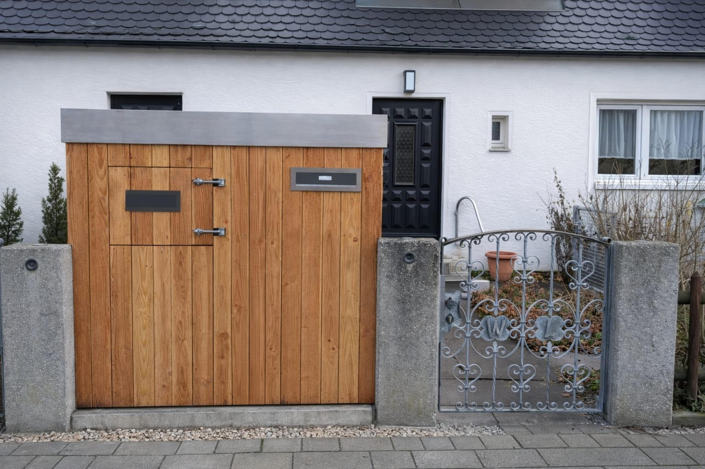
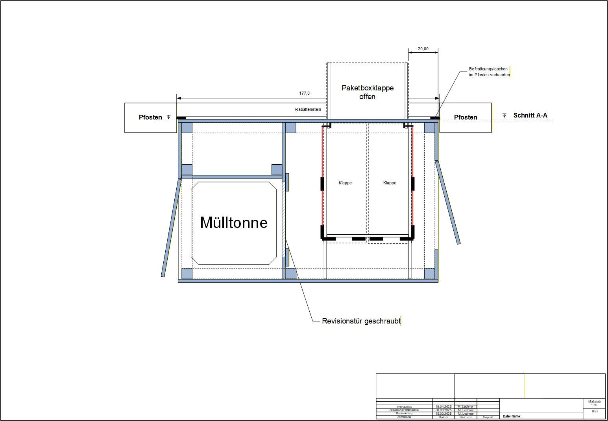

# Paketbox Steuerung 📦



*Die intelligente Paketbox mit automatischer Lieferannahme und Verriegelung.*

Dieses Projekt steuert eine intelligente Paketbox mit einem **Raspberry Pi Zero W2**. Die Box kann Pakete sicher aufnehmen, automatisch verriegeln und entleeren. Die Steuerung erfolgt über zwei Elektormotoren und diverse Sensoren mit professioneller Fehlerbehandlung und Logging. Sensorein- und Motorausgänge sind galvanisch über Optokoppler vom Raspberry Pi getrennt.

## ✨ Features
- **Automatisches Öffnen und Schließen** der Entleerungsklappen
- **Intelligente Türverriegelung** nach Paketeingang
- **Umfassende Sensorüberwachung** für alle Klappen und Türen
- **Robuste Fehlerbehandlung** mit automatischen ERROR-States
- **Professionelles Logging** mit Datei- und Console-Output
- **Mock-Modus** für lokale Entwicklung ohne Hardware
- **MQTT-Integration** für IoT-Benachrichtigungen
- **Thread-sichere Zustandsverwaltung** mit Locking-Mechanismen
- **Modulare Architektur** mit separaten Komponenten
- **15-Minuten-Watchdog** für geöffnete Paketzustellertüren inkl. MQTT-Warnung und Auto-Entleerung
- **Lichtschranke mit Notstopp** für Schutz vor Einklemmungen
- **MQTT-basierte Steuerung** (Status, Zusteller/Briefkasten/Entleerung, Auto-Lock-Door)
- **Zeitgesteuerte Türverriegelung** mit konfigurierbaren Sperrzeiten
- **Ereignisse für Briefkasten & Paketbox** über MQTT Entleerungsbetrieb

## 🆕 Neueste Änderungen (Frühjahr 2026)
- **Watchdog für geöffnete Türen**: In `handler.py` überwacht ein 15-Minuten-Timer offene Paketzustellertüren, verschickt bei Bedarf MQTT-Warnungen und startet automatisch den Entleerungszyklus.
- **Zentraler TimerManager**: `TimerManager.py` verwaltet jetzt alle Motor-, Prüf- und Watchdog-Timer mit Thread-Lock, wodurch Nothalt-Szenarien sämtliche Timer zuverlässig abbrechen.
- **Verbesserter Fehler-Reset**: `ResetErrorState()` initialisiert Türsensoren neu, setzt Motorzustände sicher auf `STOPPED` und verhindert doppelte MQTT-Fehlerbenachrichtigungen.

## 🔧 Hardware

### 🏗️ Bauweise und Konstruktion

#### Korpus und Verkleidung
- **Skelett**: 22mm Sekieferplatten für Stabilität und Witterungsbeständigkeit
- **Dachabdichtung**: Wetterfeste Untersparrenbahn zum Schutz vor Feuchte
- **Außenverkleidung**: Lärchenbretter für natürlichen, langlebigen Wetterschutz und ästhetisches Erscheinungsbild

#### Dach
- **Hauptelement**: Edelstahlwanne mit zwei Überläufen für sichere Wasserableitung
- **Wassermanagement**: Dränage- und Wasserspeicherelement mit Filtervlies
- **Begrünung**: Sedum-Dachbegrünung für Isolierung, Regenwasserbewirtschaftung und Ästhetik


*Draufsicht der Paketbox zeigt die räumliche Anordnung der Paketzustellungsklappe, Briefkastenklappe und Mülltonnentür.*

### 🚪 Türen und Klappen

Die Paketbox verfügt über mehrere spezialisierte Öffnungen:

#### 1. **Paketzustellungsklappe** (mit Motorenantrieb)
- Von der Straße/Gehweg zugänglich
- Mit automatischem Seilzug-System ausgestattet (Feder + Gegengewicht)
- Automatisches Schließen nach Paketeinwurf
- **Automatisierte Entleerung**: Nach Paketeinwurf und Klappenschließung verriegelt ein Magnetbolzen die Tür
- Zwei **Linearmotoren** fahren dann synchron die beiden unteren Entleerungsklappen auf
- Pakete fallen durch die Linearmotoren-Klappen in den unteren Bereich
- Klappen schließen automatisch nach vollständiger Öffnung
- Tür entriegelt, wenn Klappen oben sind – Prozess kann erneut beginnen

#### 2. **Briefkastenklappe**
- Zum Entnehmen von Briefen aus dem integrierten Briefkasten
- Mit Magnetschalter ausgestattet

#### 3. **Mülltonnentür**
- Separate Tür zur sicheren Unterbringung der Mülltonne
- Mit Magnetschalter ausgestattet

### 🔐 Verriegelung und Sicherheit

#### Magnetbolzen-System
- **Automatische Verriegelung**: Nach Paketeinwurf wird die Paketzustellungstür mit einem Magnetbolzen verriegelt
- Verhindert unbeabsichtigtes erneutes Öffnen während des Entleerungsvorgangs
- Entsperrt automatisch, wenn die inneren Klappen wieder geschlossen sind

#### Lichtschranke
- **Position**: Unterhalb der elektrischen Entleerungsklappen
- **Funktionen**:
  - **Einklemmschutz**: Erkennt Hindernisse und unterbricht den Motorvorgang
  - **Schutz vor Überfüllung**: Verhindert, dass zu viele Pakete eingelagert werden
  - **Notfallvoraussetzung**: Auslöser für Nothalt-Szenarien

### 📡 Sensorik und Steuerung

#### Magnetkontaktsensoren
- In **allen Türen und Klappen** eingebaut
- Erkennen Öffnen und Schließen der einzelnen Komponenten
- Liefern Rückmeldung für sichere Zustandsverfolgung

#### Endlagensensoren
- An beiden **Linearmotor-Klappen** für Position (offen/geschlossen)
- Ermöglichen sichere Koordination des Öffnungs- und Schließvorgangs

#### Steuerelektronik
- **Raspberry Pi Zero W2** als zentrale Steuereinheit mit GPIO-Kontrolle
- **Galvanische Trennung**: Sensorein- und Motorausgänge sind über Optokoppler galvanisch vom Raspberry Pi getrennt
  - Schützt die empfindliche Elektronik des Raspberry Pi vor Spannungsspitzen und Störungen
  - Erhöht die Zuverlässigkeit und Lebensdauer der Steuerung
  - Ermöglicht sichere Arbeit mit unterschiedlichen Spannungssystemen
- **Relais-Board** für Motorsteuerung und Magnetbolzen-Verriegelung
- **2 Linearmotoren** mit präziser Positionskontrolle für Entleerungsklappen

### 💡 Beleuchtung

- **Automatische Beleuchtung** in den Fächern für Mülltonne und Pakete
- Wird durch Magnetschalter bei Türöffnung ein- und ausgeschaltet
- Verbessert Benutzerfreundlichkeit und Sicherheit


*Elektronische Komponenten: Raspberry Pi, Relais-Board, Sensorleitungen und Spannungsversorgung.*

## 🚀 Quick Start

### Installation
1. **Python 3** installieren (3.7+)
2. **Repository klonen**:
   ```bash
   git clone https://github.com/lechmax/paketbox.git
   cd paketbox
   ```
3. **Abhängigkeiten** (optional):
   ```bash
   pip install paho-mqtt  # Für MQTT-Funktionalität
   pip install RPi.GPIO   # Nur auf Raspberry Pi
   ```

### Erste Schritte
```bash
# Lokaler Test (Mock-Modus)
python paketbox.py

# Tests ausführen (empfohlen)
python tests/run_tests.py

```

## 🛠️ Entwicklung & Test

### Lokale Entwicklung
```bash
# Mock-Modus für Entwicklung ohne Hardware
python paketbox.py
# Ausgabe: "[MOCK] GPIO setmode(BCM)" zeigt Simulation an

# Tests ausführen (umfassend)
python tests/run_tests.py

# Spezifische Tests
python -m unittest tests.test_paketbox.TestPaketBox.test_Klappen_oeffnen_success -v
```

### Test-Umgebung
Das Projekt enthält eine umfassende Test-Suite:
- **GPIO-Simulation**: Vollständige Hardware-Simulation ohne Raspberry Pi
- **Unit Tests**: Testen einzelne Komponenten und Funktionen
- **Integration Tests**: Testen komplette Arbeitsabläufe
- **Thread-Safety Tests**: Prüfen gleichzeitige Operationen

```bash
# Alle Tests ausführen (dauert ~1-2 Minuten)
PYTHONPATH=. python tests/run_tests.py

# Einzelne Test-Klasse
PYTHONPATH=. python -m unittest tests.test_paketbox.TestPaketBox -v
```

### Logging & Debugging
```bash
# Log-Datei überwachen
tail -f paketbox.log

# Debug-Level erhöhen (in paketbox.py)
logging.basicConfig(level=logging.DEBUG)
```

### Code-Qualität
- **GPIO-Debouncing**: Verhindert Mehrfachauslösung von Sensoren
- **Thread-Safe**: Alle Zustandsänderungen sind thread-sicher implementiert
- **Error Recovery**: Automatische ERROR-States bei Hardware-Fehlern
- **Zentrale Konfiguration**: Alle Parameter in `config.py`
- **Timer-Management**: Sichere Verwaltung von Motor-Timern

## 📁 Projektstruktur

```
max_paket_box/
├── paketbox.py                     # Hauptsteuerung (Version 0.7.0)
├── handler.py                      # Handler-Funktionen für GPIO und Motoren
├── state.py                        # Zentrale Zustandsverwaltung
├── config.py                       # Konfiguration und GPIO-Pin-Zuordnungen
├── PaketBoxState.py                # Zustandsklassen (Door/Motor States)
├── TimerManager.py                 # Timer-Verwaltung für Motoren
├── mqtt.py                         # MQTT-Integration für IoT-Benachrichtigungen
├── blueprint/
│   ├── electronic_components.jpg   # Aufbau Schaltschrank mit Raspberry Pi 
│   ├── Paketbox Seitenansicht.jpg  # Technische Zeichnung Korpus Seitenasicht
│   ├── Paketbox_Draufsicht.jpg     # Technische Zeichnung Korpus Draufsicht
│   └── Paketbox.jpeg               # Ansicht fertige Paketbox
├── tests/
│   ├── test_paketbox.py            # Umfassende Unit Tests
│   └── run_tests.py                # Test Runner mit detailliertem Output
├── paketbox.log                    # Strukturierte Log-Datei
└── README.md                       # Diese Datei
```

### Modulare Architektur (Version 0.8.0)
Das System wurde in separate Module aufgeteilt:
- **`paketbox.py`**: Hauptsteuerung und GPIO-Event-Loop
- **`handler.py`**: GPIO-Handler und Motor-Steuerungsfunktionen
- **`state.py`**: Zentrale Zustandsverwaltung für Thread-Sicherheit
- **`config.py`**: Alle Konfigurationen und GPIO-Pin-Zuordnungen
- **`PaketBoxState.py`**: Enum-Definitionen für Tür- und Motorstatus
- **`TimerManager.py`**: Sichere Verwaltung von Motor-Timern
- **`mqtt.py`**: MQTT-Integration mit Fallback-Mechanismus

## ⚙️ Konfiguration (config.py)

Die `config.py` enthält alle Systemparameter und GPIO-Pin-Zuordnungen:

### Timer & Steuerung
```python
CLOSURE_DELAY = 60              # Verzögerung vor dem Schließen der Klappen (Sekunden)
CLOSURE_TIMER_SECONDS = 65      # Zeit zum automatischen Schließen der Klappen
OPENING_TIMER_SECONDS = 65      # Zeit zum automatischen Öffnen der Klappen
DEBOUNCE_TIME = 0.2             # Entprellungszeit für Sensoren (Sekunden)
```

### Türverriegelung
```python
TIME_LOCK_DOOR = "00:00"        # Uhrzeit: Türverriegelung aktiviert
TIME_UNLOCK_DOOR = "05:30"      # Uhrzeit: Türverriegelung deaktiviert (Lieferung möglich)
```

**Setup**: `python setup_versioning.py`
**Dokumentation**: Siehe `VERSIONING.md`

## 🌐 MQTT-Integration

Das System unterstützt MQTT für IoT-Benachrichtigungen:

```bash
# MQTT-Konfiguration über Umgebungsvariablen
export MQTT_BROKER="your-mqtt-broker.local"
export MQTT_USER="username"
export MQTT_PASS="password"

# Oder Standard-Fallback-Werte verwenden (für Tests)
python paketbox.py  # Verwendet Fallback-Werte wenn MQTT nicht verfügbar
```

**MQTT-Topics**:
- `home/raspi/paketbox_text` - Statusnachrichten
- `home/raspi/paketbox` - Paket-Zusteller-Events
- `home/raspi/briefkasten` - Briefkasten-Events
- `home/raspi/paketboxleeren` - Paketbox-Entleerungs-Events

## 🛡️ Lichtschranke - Sicherheitseinrichtung

Die Lichtschranke ist eine kritische Sicherheitseinrichtung zum Schutz vor Einklemmungen:

### Funktionsweise
- **Lichtschranke** erfasst kontinuierlich den Betriebszustand
- **Auslösung**: Wenn die Schranke unterbrochen wird (z.B. Finger/Hand im Weg)
- **Notfall-Reaktion**: Motor stoppt sofort, um Verletzungen zu vermeiden
- **Überwachung**: System protokolliert jede Auslösung im Logger

### Sicherheitsprotokoll
- ✅ **Sofortiger Motorstopp** bei Erkennung von Hindernissen
- ✅ **Fehlerprotokollierung** für Wartungsstatistiken
- ✅ **Manuelle Rückstellung** erforderlich nach Auslösung
- ✅ **Integrale Prüfung** bei System-Reset

Diese Funktion entspricht Sicherheitsanforderungen für automatische Türsysteme.

## ⚠️ Sicherheit & Fehlerbehandlung

### Automatische Fehlererkennung
- **Lichtschran-Auslösung**: Sofortiger Motorstopp bei Oberflächenblockade
- **Motor-Blockage**: Erkennung wenn Klappen nicht öffnen/schließen
- **GPIO-Fehler**: Behandlung von Hardware-Fehlern
- **Timer-Management**: Sichere Abbruchfunktionen für alle Timer
- **Error-Recovery**: Automatische Wiederherstellung nach Fehlern

### Reset-Funktionen
```python
# Manueller Reset bei Fehlerzuständen
handler.ResetErrorState()  # Setzt alle Fehler zurück
handler.ResetDoors()       # Bringt Türen in sicheren Zustand
```

## 🧪 Test-Coverage

Die Test-Suite deckt ab:
- ✅ Alle GPIO-Event-Handler (Klappen, Türen, Sensoren)
- ✅ Alle Motor-Steuerungsfunktionen (Öffnen/Schließen mit Timern)
- ✅ Tür-Verriegelung/Entriegelung
- ✅ Komplette Lieferzyklen (End-to-End)
- ✅ Fehlererkennung und Wiederherstellung
- ✅ Thread-sichere Zustandsverwaltung
- ✅ GPIO-Debouncing und Timer-Operationen
- ✅ MQTT-Integration (mit Fallback)
- ✅ Motor-Blockage-Szenarien

### Validierung
```bash
# Kritische Validierung nach Änderungen
python tests/run_tests.py  # Alle Tests müssen bestehen
python paketbox.py         # Anwendung muss ohne Fehler starten
```

## 📊 System-Requirements

### Laufzeit-Abhängigkeiten
- **Python 3.7+**: Hauptsprache
- **Standard-Bibliotheken**: threading, logging, time, enum
- **Optional**: paho-mqtt (für MQTT-Funktionalität)
- **Hardware**: RPi.GPIO (nur auf Raspberry Pi)

### Entwicklungs-Abhängigkeiten  
- **unittest**: Für Tests (integriert)
- **unittest.mock**: Für Hardware-Mocking (integriert)
- **Keine externen Tools**: Vollständig in Python implementiert

## Lizenz
MIT

## Autoren
- Andreas Beyer
- Maximilian Lechner

